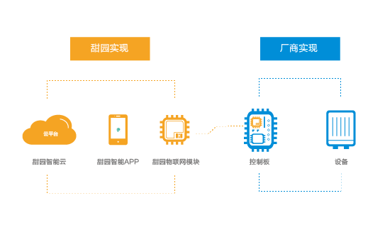

# 基于ESP8266的开源MCU方案 Open WiFi-MCU Solution

## 【2018迎新年送开发板活动】免费申请 TY-S1 开发板

## 甜园智能平台介绍

> 甜园智能是[北京甜园科技有限公司](http://www.tianyuantechnology.com)开发的智能家居平台，目的是为用户打造全屋智能的卓越体验

> 甜园智能平台支持*WiFi*/*ZigBee*/*GPRS*/*Lora*/*2.4G*等多种协议接入，目前已接入智能灯，插座，面板，窗帘，传感器，家电，安防，锁，摄像头，语音机器人等[40多款产品](http://www.tianyuantechnology.com/product/security.html)

> 甜园智能提供**端到端**的一站式方案，包括免费的物联网云服务，全屋智能产品互联互通的APP [iOS版本](https://itunes.apple.com/cn/app/tian-yuan-zhi-neng/id1076168513?mt=8) & [iOS-PAD版本](https://itunes.apple.com/cn/app/%E7%94%9C%E5%9B%AD%E6%99%BA%E8%83%BDhd/id1315566055?mt=8) & [Android版本](http://a.app.qq.com/o/simple.jsp?pkgname=com.rhxtune.smarthome_app) (**APP支持LOGO客户定制**)，OEM/ODM/Open的产品方案

## 甜园智能开源WiFi-MCU方案

> 基于甜园智能平台的ESP8266的开源WiFi-MCU方案，目的是为智能家居产品制造企业提供一个**全开放-高效率-低成本**的智能化方案

> 开源WiFi-MCU方案通信协议 - [甜园智能串口通信协议 - Open](http://wifi-open.docs.t2.5itianyuan.com/HUADI_PLT002_WR02/_book/index.html)

> [开发板TY-S1](#开发板ty-s1)

## 开源方案使用示例

基于**开源方案**和**TY-S1开发板**可以：

1. 快速实现多种智能产品的原型开发，智能开关、彩灯、窗帘、情景面板、报警器、传感器等产品提供示例源代码
2. 基于系统互联互通的特性，使用多个开发板轻松实现**情景模式**、**产品联动**功能
3. 基于系统提供的安防模块功能，实现安防产品报警（*系统通知* & *短信通知* & *电话通知*）

| 产品示例 / 链接                                            | 描述                                                  |
|------------------------------------------------------------|-------------------------------------------------------|
| [智能三路开关面板](doc/smart_switch_demo.md)               | 控制智能开关面板**On/Off**                            |
| [智能彩灯](doc/smart_color_lamp_demo.md)                   | 控制智能彩灯**On/Off**、**亮度**和**颜色**            |
| [智能声光报警器](doc/smart_alarm_demo.md)                  | 智能声光报警器**On/Off**                              |
| [智能窗帘](doc/smart_three_state_switch_demo.md)           | 控制智能窗帘**On/Off/Pause**和*位置*                  |
| [智能情景面板](doc/smart_scene_panel_demo.md)              | 控制智能情景模式                                      |
| [智能温湿度传感器](doc/smart_dht12_sensor_demo.md)         | 智能温湿度传感器                                      |
| [智能空气检测仪](doc/smart_air_quality_detector_demo.md)   | 智能PM2.5传感器                                       |
| --------------------------------                           | ------------------------------------------------      |
| [一键场景](doc/one_key_scene.md)                                                     | 一键场景**同时**控制多个设备                          |
| [定时场景](doc/timing_scene.md)                                                      | 定时场景在设定时间(*单次*&*重复*)执行设定指令         |
| [联动场景-温湿度触发单个任务](doc/linkage_sence_dht12_alarm.md)                      | **智能温湿度传感器**触发**智能声光报警器**            |
| [联动场景-空气质量触发多个任务](doc/linkage_sence_air-quality-detector_switch.md)    | **智能空气检测仪**触发**智能开关**和**智能彩灯**      |
| --------------------------------                           | ------------------------------------------------      |
| [短信&电话报警](#)                                         | **智能门窗磁&燃气等传感器**触发**短信&电话**报警      |
| [智能门锁](#)                                              | **智能门锁**远程开锁                                  |

## 开发板TY-S1

> [开发板TY-S1 - 原理图](doc/WifiDevelopBoard_SchematicV1_2.pdf)

> [开发板TY-S1 - 3D PCB效果图](doc/WIFI_DB_PCB.pdf)

> [开发板TY-S1 - 使用说明](doc/TY_S1_spec.md)
