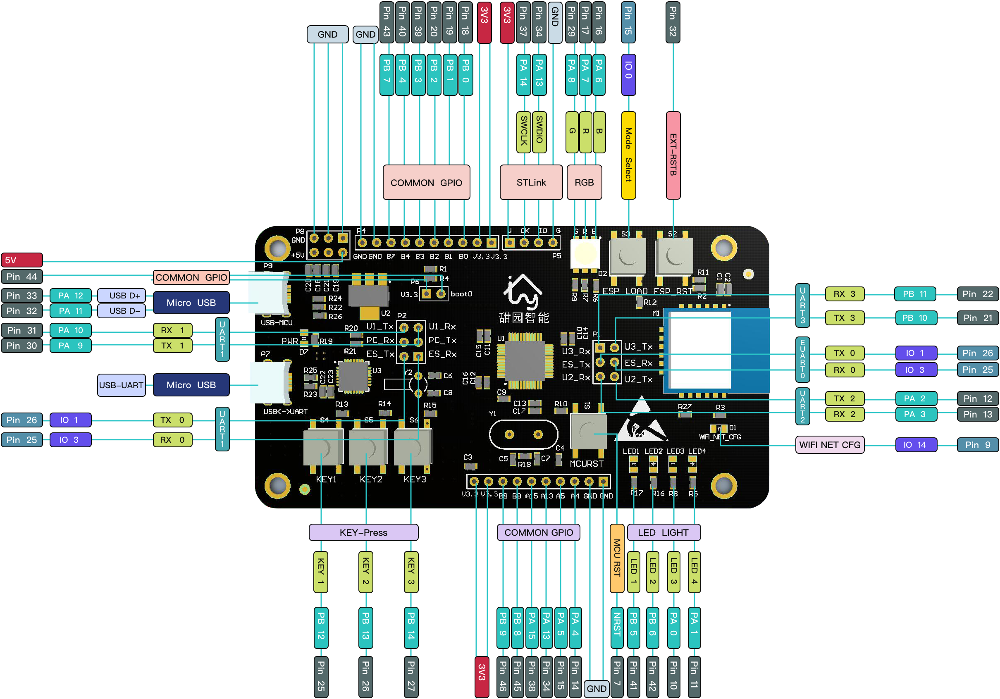

# 概述

>甜园智能云平台开发板TY-S1是基于ESP8266模块与STM32F103-C8T6主控芯片，对接甜园智能云平台的集体验、学习、测试、开发于一体的实验板。

>开发板兼顾多功能与便捷性，提供丰富的外围电路接口，采用标准2.54mm排针，方便与各种器件对接。

# 配置如下

* 两个Mini-USB接口
* 一个STLink下载调试口
* 三路5V供电
* 四路3.3V供电
* 一个RGB彩灯
* 六个LED灯
* 六个按键
* 标准2.54mm 13PIN排针空闲GPIO接口
* 一个CP2102 USB转串口芯片
* 一个MCU的BOOT跳线
* 一个MCU的UART2、UART3与ESP8266的数据传输跳线选择
* 一个CP2102的UART口与MCU的UART1或ESP8266的UART0连接的跳线选择

# 外设分布介绍

> 尺寸：3583.677 * 1968.504（mil*mil）

# 功能介绍

> 供电

>> Mini USB的5V供电（两路mini USB接口都可用）

> 下载调试以及串口连接

>> 将USB数据线连接mini USB口，并在左侧跳线帽处将PC与U1连接，接通MCU的uart1,烧写程序，或者用STLink接STLink接口调试

> LED指示灯

>> MINIUSB接入电源，该口旁红色LED指示灯亮起电源供电正常

>> esp8266的wifi状态指示灯在模块正常启动后闪烁（周期1S），当模块连接网络成功并设备注册入网成功后停止闪烁常亮
